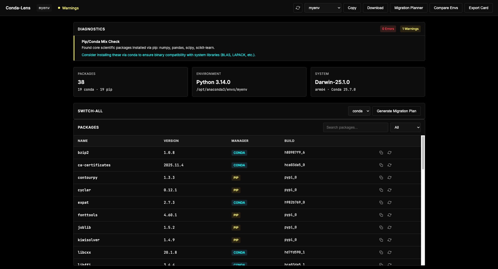

# Conda-Lens 🔬

Conda-Lens is a CLI and lightweight dashboard for inspecting Python environments, diagnosing compatibility issues, analyzing dependency graphs, and generating reproducibility snapshots.

Conda-Lens helps developers understand their Python environments across `conda`, `pip`, `uv`, and `pixi` workflows. It provides fast, transparent analysis with a clean UI for viewing environment details, diagnostics, and migration planning.



## Demo

*Watch the full [demo here](conda-lens-demo.mov)*


## Features

- Environment Inspector: Deep inspection of conda, pip, and uv packages
- Diagnostic Engine: Rule-based analysis for detecting conflicts, missing dependencies, and compatibility issues
- Reproducibility Snapshots: Generate shareable environment cards with full metadata
- Dependency Graph Viewer: Visualize package dependencies and reverse dependencies
- Migration Analysis: Analyze package manager migrations (pip ↔ conda ↔ uv ↔ pixi)
- Smart Caching: Fast resolver caching for improved performance
- Web Dashboard: Optional browser-based UI for visual exploration

## Architecture

Conda-Lens consists of three layers:

1. CLI: Command-line interface for quick inspections and diagnostics
2. API: FastAPI backend providing environment data and analysis endpoints
3. Dashboard: Optional web UI for visual exploration (read-only for migrations)

## Installation

```bash
pip install conda-lens
```
**NOTE**: During development, this doesn't work. Instead, use the following:
```bash
pip install -e .
```

Requirements: Python 3.9+ recommended

## CLI Usage

[Obs.: `--env` has been implemented; add instructions here later]

### Inspect Environment

View detailed information about your current environment:

```bash
conda-lens inspect
```

Output includes environment name, path, Python version, platform info, and package list.

### Run Diagnostics

Analyze your environment for potential issues:

```bash
conda-lens diagnose
```

The diagnostic engine checks for:
- Duplicate packages across managers
- Version conflicts
- Missing dependencies
- CUDA compatibility issues
- Python version mismatches

### Generate Reproducibility Snapshot

Create a reproducibility card for your environment:

```bash
# Display to stdout
conda-lens repro-card

# Save to file
conda-lens repro-card --output repro.yaml

# JSON format
conda-lens repro-card --output repro.json --format json
```

### Warm Dependency Cache

Pre-populate the resolver cache for faster analysis:

```bash
conda-lens cache warm
```

### Migration Planning

Analyze package manager migrations:

```bash
# Plan migration to conda
conda-lens switch-all --to conda

# Plan migration to pip
conda-lens switch-all --to pip

# Migrate specific packages
conda-lens switch-all --to uv numpy scipy pandas

# Execute migration (use with caution)
conda-lens switch-all --to conda --execute --yes
```

Note: Migration execution is CLI-only. The dashboard provides read-only analysis.

### Additional Commands

```bash
# Lint Python files for missing imports
conda-lens lint path/to/code

# Undo last migration
conda-lens undo

# Cache management
conda-lens cache refresh
conda-lens cache stats
conda-lens cache clear
```

## Dashboard Usage

Launch the web dashboard:

```bash
conda-lens web
```

The dashboard will start at `http://127.0.0.1:8000` (or next available port).

### Dashboard Features

1. Environment Selector: Switch between conda environments
2. Package Inspector: Search, filter, and view package details
3. Diagnostics Panel: Visual display of environment health
4. Reproducibility Card: View and download environment snapshots
5. Migration Planner: Analyze package manager migrations (read-only)
6. Dependency Graph: Visualize package dependencies

### Using the Migration Planner

The dashboard migration planner is read-only and provides:

- Target manager selection (pip, conda, uv, pixi)
- Safety analysis for each package
- Conflict detection
- Version availability checking
- Dependency impact analysis

Important: 
- The planner does NOT auto-trigger on page load
- Changing environments resets the target manager to "pip"
- All resolver calls use the disk cache at `~/.cache/conda-lens/resolver/`
- Migration execution must be done via CLI

### Caching for Performance

The dashboard uses aggressive caching to improve performance:

- Resolver Cache: Package version lookups are cached to disk
- Dependency Cache: Dependency graphs are cached and refreshed daily
- Cache Location: `~/.cache/conda-lens/resolver/<package>.json`

To warm the cache manually:

```bash
conda-lens cache warm
```

## Reproducibility Card

The reproducibility card captures:

- Environment metadata (name, path, Python version)
- Complete package list with versions and managers
- Platform information (OS, architecture)
- CUDA driver version (if applicable)
- GPU information (if applicable)
- Timestamp and conda-lens version

### Why It Matters

Reproducibility cards enable:

- Collaboration: Share exact environment specs with teammates
- Debugging: Reproduce issues in identical environments
- Documentation: Track environment evolution over time
- Compliance: Maintain audit trails for production environments

### Sharing Snapshots

```bash
# Generate YAML snapshot
conda-lens repro-card --output snapshot.yaml

# Generate JSON snapshot
conda-lens repro-card --output snapshot.json --format json

# Share via version control
git add snapshot.yaml
git commit -m "Add environment snapshot"
```

## Caching System

Conda-Lens uses a two-tier caching system:

### 1. In-Memory Cache

Fast lookups for the current session. Cleared when the process exits.

### 2. Disk Cache

Persistent cache stored at `~/.cache/conda-lens/resolver/`:

- Package versions: Cached per manager (conda, pip, uv, pixi)
- Dependencies: Cached dependency graphs
- TTL: Cache entries are validated on each use

### Cache Commands

```bash
# Warm the cache (pre-populate with current environment)
conda-lens cache warm

# Warm cache in parallel (faster)
conda-lens cache warm --parallel

# View cache statistics
conda-lens cache stats

# Clear all cache entries
conda-lens cache clear

# Refresh stale entries
conda-lens cache refresh
```

### Dashboard Caching Behavior

- All resolver calls check the disk cache first
- Cache hits are logged: `INFO: Using cached resolver result for <package> from <manager>`
- The dashboard automatically uses `use_disk_cache=True` for all migration planning
- Background worker refreshes dependency cache every 24 hours

## Contributing

See [CONTRIBUTING.md](CONTRIBUTING.md) for development setup, coding standards, and how to submit pull requests.

## License

MIT License - see LICENSE file for details.
